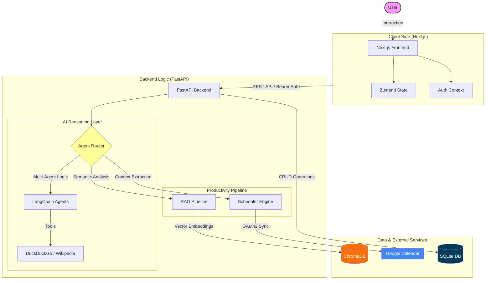

# ProdAgent — Enterprise-Grade AI Productivity Suite

[](https://fastapi.tiangolo.com/)
[](https://nextjs.org/)
[](https://langchain.com/)
[](https://groq.com/)
[](https://developers.google.com/calendar)

ProdAgent is a sophisticated, multi-user AI productivity platform designed to streamline workflows through autonomous agents, intelligent scheduling, and RAG-based document intelligence. Built with a modern micro-architecture, it leverages **Llama 3.1** via **Groq** for near-instant inference and **Google Calendar API** for seamless ecosystem integration.

---

## ✨ Features

### 🤖 Multi-Agent AI Ecosystem
*   **Autonomous Router (Auto Mode):** Intelligently routes queries to specialized agents using a decision-making chain.
*   **Code Agent:** A senior-level programming assistant with access to real-time Wikipedia and Web search.
*   **Writer Agent:** Focused on high-quality, structured content generation with adaptive tone.
*   **Chat Agent:** A conversational assistant with system-level awareness and administrative tool access.

### 📅 AI-Powered Scheduling & Synchronization
*   **Syllabus Generation:** Automatically generates comprehensive learning paths or project schedules using real-time web search (DuckDuckGo/Wikipedia).
*   **Dynamic Customization:** Support for duration-based planning, gap days, and specific start dates.
*   **Google Calendar Sync:** Direct integration to push AI-generated schedules to user calendars with full OAuth2 isolation.

### 📄 Document Intelligence (RAG)
*   **Semantic PDF Analysis:** Upload documents and engage in context-aware conversations using a Vector Search pipeline.
*   **Automated Summarization:** Generate concise 3-5 sentence summaries or detailed bullet-point study notes.
*   **Multi-User Isolation:** Document embeddings are stored in per-user vector stores for strict data privacy.

### 🔐 Enterprise Features
*   **Admin Dashboard:** Real-time platform statistics, usage trends, activity logging, and user management.
*   **Subscription Tiers:** Integrated support for Free and Premium tiers with feature gating.
*   **Multi-Tenant Architecture:** Complete data isolation for chats, documents, and credentials in a secure SQLite environment.

---

## 🛠 Tech Stack

### Frontend
*   **Framework:** Next.js 14 (App Router)
*   **Language:** TypeScript
*   **Styling:** Tailwind CSS + Framer Motion (Animations)
*   **State Management:** Zustand
*   **UI Components:** Shadcn/UI + Radix UI
*   **Data Visualization:** Recharts

### Backend
*   **Framework:** FastAPI (Python 3.11+)
*   **AI Orchestration:** LangChain
*   **LLM Inference:** Groq (Llama-3.1-8b-instant)
*   **Authentication:** JWT-like Token Sessions + Google OAuth 2.0
*   **Validation:** Pydantic v2

### AI/ML & Data
*   **Embeddings:** HuggingFace (`sentence-transformers/all-MiniLM-L6-v2`)
*   **Vector Database:** ChromaDB
*   **Search Engine:** DuckDuckGo + Wikipedia API
*   **Database:** SQLite (Custom `Store` management layer)

---

## 🏗 Architecture Overview



---

## 📂 Project Structure

```text
AI_Productivity_Agent/
├── Backend/
│   ├── agents/               # LangChain agent definitions & Logic
│   │   ├── agent_chain.py    # Multi-agent routing & tool binding
│   │   ├── scheduler.py      # Schedule extraction & Google API logic
│   ├── pyFiles/
│   │   └── doc.py            # RAG Pipeline (PDF → Embeddings → LLM)
│   ├── server.py             # FastAPI entry point & API routes
│   ├── db_manager.py         # Thread-safe SQLite management
│   └── vector_store/         # Persistent per-user vector databases
├── frontend/
│   ├── src/
│   │   ├── app/              # Next.js pages & layouts
│   │   ├── components/       # Shadcn/UI & custom components
│   │   ├── store/            # Zustand global state (Auth/Chat)
│   │   └── lib/              # API clients & utilities
├── start.py                  # Orchestration script for dev environments
└── credentials.json          # Google Cloud OAuth configuration
```

---

## 🚀 Getting Started

### Prerequisites
*   Python 3.11+
*   Node.js 18+
*   `uv` Package Manager (Recommended)
*   Groq API Key
*   Google Cloud Credentials (with Calendar API enabled)

### 1. Environment Configuration
Create a `.env` file in the root directory:
```env
# Backend
GROQ_API_KEY=your_groq_api_key
GOOGLE_REDIRECT_URI=http://localhost:5000/api/calendar/oauth/callback
OAUTHLIB_INSECURE_TRANSPORT=1

# Frontend (frontend/.env)
NEXT_PUBLIC_API_URL=http://localhost:5000/api
```

### 2. Backend Installation
```bash
# Using uv (fastest)
uv sync
cd Backend
# Start the server
python -m uvicorn server:app --port 5000 --reload
```

### 3. Frontend Installation
```bash
cd frontend
npm install
npm run dev
```

---

## 📊 API Documentation

| Endpoint | Method | Description | Auth |
| :--- | :--- | :--- | :--- |
| `/api/auth/login` | `POST` | User authentication & session creation | No |
| `/api/ai/chat` | `POST` | Multi-agent chat with tool access | Yes |
| `/api/ai/scheduler`| `POST` | Generate syllabus & task list | Yes |
| `/api/documents/upload` | `POST` | Upload PDF for RAG analysis | Yes |
| `/api/admin/stats` | `GET` | Platform usage analytics (Admin only) | Yes |

*Full interactive documentation is available at `{BASE_URL}/docs` via Swagger UI.*

---

## 🧠 AI Pipeline Detail

### RAG (Retrieval-Augmented Generation)
1.  **Ingestion:** PDF files are parsed and split into 1000-character chunks with 200-character overlap.
2.  **Vectorization:** Chunks are embedded using `all-MiniLM-L6-v2` and stored in a user-isolated ChromaDB directory.
3.  **Retrieval:** Top-k (k=2) similarity search is performed on user queries.
4.  **Generation:** Context is injected into a Llama 3.1 prompt for structured extraction.

### Intelligent Scheduling
1.  **Extraction:** LLM extracts `goal`, `duration`, and `gap_days` from natural language.
2.  **Syllabus Build:** Agent performs a web search for the topic syllabus.
3.  **Optimization:** Tasks are distributed across the timeline into 1-3 hour blocks.
4.  **Sync:** Events are pushed via Google Calendar API with attendee notifications.

---

## 🛠 Troubleshooting

*   **OAuth Redirect Mismatch:** Ensure `http://localhost:5000/api/calendar/oauth/callback` is added to your Google Cloud Console Authorized redirect URIs.
*   **Database Locked:** The app uses a thread-safe custom wrapper, but avoid manual SQLite edits while the server is running.
*   **Vector Store Errors:** If document analysis fails, clear the `Backend/vector_store/[user_id]` folder to force re-indexing.

---

## 🗺 Roadmap

- [ ] **Real-time Streaming:** Implement Server-Sent Events (SSE) for AI chat responses.
- [ ] **Collaborative Schedules:** Share learning plans with other users.
- [ ] **Mobile App:** React Native companion for push notification reminders.
- [ ] **Extended RAG:** Support for DOCX, CSV, and Notion integration.

---

## 📜 License
Distributed under the MIT License. See `LICENSE` for more information.

**Author:** N Paavan Siri Vardhan  
**Email:** [naravapaavansirivardhan@gmail.com](mailto:naravapaavansirivardhan@gmail.com)